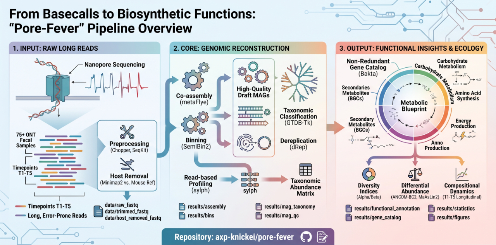

# From Basecalls to Biosynthetic Functions: "Pore-Fever" Pipeline

An end-to-end, automated bioinformatics workflow engineered for long-read Oxford Nanopore Technology (ONT) metagenomic tracking. Designed to process longitudinal multi-timepoint datasets, this pipeline handles everything from raw error-prone basecalls down to high-resolution functional insights, metabolic blueprint reconstruction, and statistical modeling.



# ONT Mouse Gut Metagenomics

Script scaffold for a 75-sample Oxford Nanopore mouse gut metagenomics study:

- 5 treatment groups: `control`, `placebo`, `treatment1`, `treatment2`, `treatment3`
- 5 time points: `T1` to `T5`
- 3 biological replicates per treatment/time point
- Input: basecalled ONT FASTQ files
- Main outputs: cleaned reads, QC summaries, taxonomic tables, MAG catalog, functional tables, statistics, and figures

## Repository Status

This repository is a script scaffold and learning-oriented workflow template for ONT long-read mouse gut metagenomics. It is not yet a fully validated production pipeline. Before real analysis, users must confirm sample metadata, FASTQ paths, database paths, software versions, filtering thresholds, adapter-trimming behavior, and HPC resource settings.

## 📋 Pipeline Architecture & Workflow

The pipeline is structured into three discrete phases, linking data processing natively with specific output directories:

### 1. Input & Preprocessing
* **Raw Long Reads:** Processes ONT fecal samples across multi-timepoint longitudinal studies (e.g., T1–T5).
* **Quality Control & Trimming:** Utilizes `Chopper` and `SeqKit` to filter low-quality, short, or error-prone reads (`data/trimmed_fastq`).
* **Host Contamination Removal:** Aligns reads using `Minimap2` against a reference genome (e.g., Mouse Ref) to extract clean microbial reads (`data/host_removed_fastq`).

### 2. Core Genomic Reconstruction
* **Co-assembly:** Reconstructs complex communities via `metaFlye` (`results/assembly`).
* **Metagenome-Assembled Genomes (MAGs):** Extracts high-quality draft genomes using `SemiBin2` (`results/bins`).
* **Dereplication & Classification:** Generates a non-redundant set of MAGs via `dRep` (`results/mag_dereplication`) and resolves taxonomy using `GTDB-Tk` (`results/mag_taxonomy`).
* **Fast Profiling:** Runs parallel read-based taxonomic profiling using `sylph` to output taxonomic abundance matrices.

### 3. Output: Functional Insights & Ecology
* **Functional Annotation:** Predicts genes using `Bakta` to compile non-redundant gene catalogs (`results/gene_catalog`), reconstructing carbohydrate metabolism, amino acid synthesis, and energy production profiles.
* **Secondary Metabolites:** Identifies Biosynthetic Gene Clusters (BGCs) (`results/functional_annotation`).
* **Downstream Ecology & Statistics:** Leverages R workflows to compute Alpha/Beta diversity indices, track longitudinal compositional dynamics, and evaluate differential abundance via `ANCOM-BC2` and `MaAsLin2` (`results/statistics`, `results/figures`).

---

## 📂 Repository Structure

```text
pore-fever/
├── config/                  # Configuration profiles & sample sheets
│   ├── config.sh            # Global pipeline environment variables
│   └── samples.tsv          # Metadata tracking for longitudinal timepoints
├── data/                    # Fastq directories (Raw, Trimmed, Host-Removed)
├── envs/                    # Conda deployment environments
├── results/                 # Downstream outputs (Assemblies, MAGs, Taxonomy, Figures)
├── logs/                    # Runtime stdout and error traces
└── scripts/                 # Core execution architecture
    ├── bash/                # Execution steps (Preprocessing, Assembly, Annotation)
    ├── python/              # Post-processing taxonomy and QC tables
    └── r/                   # Statistical ecology, data modeling, and visualization


## 🚀 Getting Started

### Prerequisites

* Linux environment (Ubuntu / WSL)
* Conda or Mamba package managers

### Execution Sequence

1. **Configure Environment:** Update variables inside `config/config.sh` and list your input files within `config/samples.tsv`.
2. **Preprocess Reads:**
```bash
bash scripts/bash/01_preprocess_qc_host_removal.sh

```


3. **Taxonomic Profiling:**
```bash
bash scripts/bash/02_taxonomic_profiling.sh

```


4. **Assembly & Binning Pipeline:**
```bash
bash scripts/bash/03_assembly_mag_pipeline.sh

```


5. **Functional Annotation:**
```bash
bash scripts/bash/04_functional_annotation.sh

```


6. **Ecology, Statistics, & Report Generation:**
```bash
Rscript scripts/r/06_statistics_diversity_differential.R
Rscript scripts/r/07_visualization_reporting.R
bash scripts/bash/08_reproducibility_report.sh

```

## Quick Start: Recommended First Analysis Route

For the first pass, run the read-based workflow before attempting full co-assembly and MAG reconstruction:

```bash
bash scripts/bash/01_preprocess_qc_host_removal.sh
python scripts/python/05_summarize_fastq_qc.py
bash scripts/bash/02_taxonomic_profiling.sh
python scripts/python/03_prepare_taxonomy_table.py
Rscript scripts/r/06_statistics_diversity_differential.R
Rscript scripts/r/07_visualization_reporting.R
```

This produces cleaned reads, QC summaries, taxonomic profiles, diversity analysis, and preliminary differential abundance results. After read quality, depth, and group effects look reasonable, proceed to functional profiling and MAG reconstruction.

## Required Input Files

Before running the workflow, prepare:

- `config/samples.tsv`: sample metadata and FASTQ paths.
- `data/raw_fastq/*.fastq.gz`: basecalled ONT FASTQ files.
- `config/mouse_reference/GRCm39.fa`: mouse reference genome for host-read removal.
- `databases/sylph/gtdb-rs214-c200-dbv1.syldb`: sylph database for taxonomic profiling, or another path configured in `config/config.sh`.
- Optional databases for GTDB-Tk, CheckM2, DRAM, Bakta, eggNOG-mapper, and MMseqs2.

## Sample Metadata Format

The workflow expects `config/samples.tsv` with the following columns:

| Column | Meaning |
|---|---|
| `sample_id` | Unique sample identifier |
| `treatment` | Experimental group: `control`, `placebo`, `treatment1`, `treatment2`, `treatment3` |
| `timepoint` | Sampling time point: `T1` to `T5` |
| `replicate` | Biological replicate ID |
| `raw_fastq` | Path to the raw basecalled FASTQ file |

The current template contains all 75 expected samples. Update the `raw_fastq` values before running the workflow on real data.

## Layout

```text
config/                         sample metadata and shared settings
data/raw_fastq/                  input FASTQ files
data/trimmed_fastq/              adapter-trimmed reads
data/filtered_fastq/             length/quality-filtered reads
data/host_removed_fastq/         mouse-depleted reads
results/qc/                     read QC and host-removal summaries
results/taxonomy/               taxonomic profiles and abundance matrices
results/assembly/               co-assembly outputs
results/mapping/                read-to-contig mappings
results/bins/                   MAG binning outputs
results/mag_qc/                 MAG quality reports
results/mag_taxonomy/           MAG taxonomic assignments
results/mag_dereplication/      dereplicated MAG catalog
results/mag_abundance/          MAG abundance tables
results/functional_annotation/  MAG/gene/function annotations
results/gene_catalog/           nonredundant gene catalog
results/statistics/             diversity and differential analysis outputs
results/figures/                publication-style figures
scripts/bash/                   heavy workflow steps
scripts/python/                 validation and summary helpers
scripts/r/                      statistical analysis and visualization
logs/                           run logs
envs/                           environment notes or future conda files
```

## Pipeline Phases

| Phase | Script | Main output |
|---|---|---|
| 1-5 | `01_preprocess_qc_host_removal.sh` | Trimmed, filtered, mouse-depleted FASTQ files and QC reports |
| 6-8 | `02_taxonomic_profiling.sh`, `03_prepare_taxonomy_table.py` | Taxonomic profiles and abundance matrices |
| 9-17 | `03_assembly_mag_pipeline.sh` | Assembly, contig coverage, MAGs, MAG taxonomy, MAG abundance |
| 18-21 | `04_functional_annotation.sh` | MAG annotations, gene catalog, functional profiles |
| 22-24 | `06_statistics_diversity_differential.R` | Diversity statistics and differential abundance outputs |
| 25 | `07_visualization_reporting.R` | Publication-style figures |
| 26 | `08_reproducibility_report.sh` | Tool/version reproducibility report |

## Full Recommended Order

```bash
bash scripts/bash/01_preprocess_qc_host_removal.sh
python scripts/python/05_summarize_fastq_qc.py
bash scripts/bash/02_taxonomic_profiling.sh
python scripts/python/03_prepare_taxonomy_table.py
bash scripts/bash/03_assembly_mag_pipeline.sh
bash scripts/bash/04_functional_annotation.sh
Rscript scripts/r/06_statistics_diversity_differential.R
Rscript scripts/r/07_visualization_reporting.R
bash scripts/bash/08_reproducibility_report.sh
```

For 75 ONT fecal samples, start with the read-based route first:

```text
FASTQ -> QC -> host removal -> taxonomic profiling -> diversity -> differential taxa
```

## Adapter Trimming Behavior

Phase 1 is intentionally explicit about adapter/barcode trimming.

By default, `01_preprocess_qc_host_removal.sh` expects real adapter trimming to be configured through `ADAPTER_TRIM_CMD`:

```bash
ADAPTER_TRIM_CMD='dorado trim --emit-fastq {input} | gzip -c > {output}' \
  bash scripts/bash/01_preprocess_qc_host_removal.sh
```

The command must contain `{input}` and `{output}` placeholders. The script replaces them with the sample FASTQ path and a temporary output path.

If your FASTQ files are already demultiplexed and adapter/barcode-trimmed, run with:

```bash
TRIM_ADAPTERS=0 bash scripts/bash/01_preprocess_qc_host_removal.sh
```

Use `TRIM_ADAPTERS=0` only when upstream trimming has already been performed and documented.

## Important Notes

- Phase 7 read-level confirmation is optional and should be performed after inspecting taxonomic profiling results.
- Phase 13 MAG refinement is currently a placeholder and should be expanded if using multiple binning tools.
- Full co-assembly of 75 ONT gut metagenomes may require high-memory HPC resources.
- Sylph output formats can vary by version; inspect `results/taxonomy/sylph_species_profile.tsv` if `03_prepare_taxonomy_table.py` cannot infer columns automatically.
- Differential abundance methods such as ANCOM-BC2, ALDEx2, or MaAsLin should be added after the abundance table format and study model are finalized.

## Software Requirements

Core command-line tools:

- NanoPlot
- chopper
- minimap2
- samtools
- sylph
- Flye/metaFlye
- seqkit
- CoverM
- SemiBin2
- CheckM2
- GTDB-Tk
- dRep
- Bakta
- MMseqs2
- R with tidyverse and vegan
- Python with pandas

Recommended environment management:

- Conda/Mamba for local or HPC installation.
- Apptainer/Singularity containers for HPC reproducibility.
- Record all versions in `results/reproducibility_report.txt`.

## Approximate Compute Requirements

| Step | Suggested environment | Approximate resources |
|---|---|---|
| QC, filtering, host removal | Workstation or HPC | 8-16 CPU, 32-64 GB RAM |
| Taxonomic profiling | Workstation or HPC | 8-32 CPU, 32-128 GB RAM |
| Assembly and MAG reconstruction | HPC strongly recommended | 32-64 CPU, 128-512 GB RAM |
| R/Python statistics and plotting | Local, RStudio, Colab, or HPC | 4-8 CPU, 8-32 GB RAM |

Actual requirements depend strongly on read depth, FASTQ size, reference/database size, and assembly strategy.

## Key Expected Outputs

After successful runs, expected files include:

- `data/host_removed_fastq/*.host_removed.fastq.gz`
- `results/qc/pre_filter/`
- `results/qc/post_filter/`
- `results/qc/host_removal/*.host_removal_stats.txt`
- `results/taxonomy/sylph_species_profile.tsv`
- `results/taxonomy/taxa_abundance_matrix.tsv`
- `results/assembly/metaflye_coassembly/assembly.fasta`
- `results/assembly/assembly_seqkit_stats.tsv`
- `results/mag_qc/checkm2/`
- `results/mag_taxonomy/gtdbtk/`
- `results/mag_dereplication/drep_output/`
- `results/mag_abundance/mag_abundance.tsv`
- `results/figures/`
- `results/reproducibility_report.txt`

## Methods Summary

The workflow starts from basecalled ONT FASTQ files. Reads are quality-checked, adapter/barcode-trimmed when configured, filtered by length and quality, and mapped against the mouse reference genome to remove host-derived sequences. Host-depleted reads are used for read-based taxonomic profiling and can also be assembled into metagenomic contigs for MAG reconstruction. Reconstructed MAGs are quality-checked, taxonomically classified, dereplicated, quantified across samples, and functionally annotated. Taxonomic and functional abundance matrices are then used for diversity analysis, differential abundance testing, visualization, and reproducible reporting.
